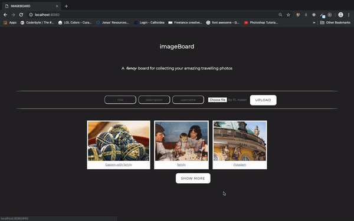

# Imageboard Project

**_A fancy imageboard for collecting all your travelling photos._**

This project was made in 5 days during the 12 weeks intensive coding bootcamp at SPICED Academy.

## Overview

An Instagram-style, single-page application website, where anybody can upload an image of their choosing, add a title along with a textual description of that image and where other user users could view that image and add some comments to it.

## Techstack

**JavaScript | Handlebars | Vue.js | AWS S3 | Node.js | Express.js | PostgreSQL**

## Features

-   On the main page a screen with the most recent uploaded images arranged responsively is being displayed.

<!--If the image upload is successful, the server should respond with a payload containing the url of the image. When the client receives this response, it should update the list of images it already has to include the image that was just uploaded. This should cause automatic re-rendering of the list of images with the newest image now appearing.-->

-   Pagination (infinite scroll) - when clicking on the more button, more images are being loaded until the last image has been displayed and the more button would disappear. (could also be set to greyed out)

-   The user can upload his/her own images using the upload function. Every time an image is being loaded, it would be displayed as the first image from the left.

-   When users click on one of the images displayed as a card on the main page, a modal will pop up containing the image in a scaled-down size. <!-- The modal should be implemented as a Vue component. When the user clicks on one of the images, our main Vue instance should set a property on itself that makes the modal appear. When the modal component mounts, at least one ajax request will have to be made. It will have to make a request to get any data for the image it does not already have as well as all of the comments for the image. To be able to get this data, the component will need to know at least the id of the image. The id of the image will have to be passed to the component as a prop.
    -->

-   In order to close the modal, the user will be able to click on an x button or outside the modal. <!--  It will have to emit an event that our Vue instance listens for so that it can know when to hide the modal. -->

-   In addition to that, users will be able to see the author's name, the title and a brief description of the image. They will be able to submit comments, which will be displayed in a reverse chronological order.

<!--
A problem our image board has is that it is not possible for our users to share links that go directly to an individual image. There is only one url for the entire site and every time you go to it you will see all of the most recently uploaded images. There is no way to go directly to a view showing a single larger-sized image with its comments in a modal.

There is a solution to this: client-side routing. The basic idea is to have your client-side Javascript read and interpret the url of the page and alter the page in accordance with it.

It is convenient to use hashes (url fragments) for this. Hashes are not sent to the server. That is, the server does the exact same thing for requests to http://localhost:8080/#funkychicken as it does for requests to http://localhost:8080/. However, the hash is readable in the browser by means of the location.hash property and it is possible to know when the hash changes by listening for the hashchange event on the window object. Although hash changes do not cause requests to be made to the server, they do generate entries in the browser history, which means that the back button works with hashes.

There is a newer technique for doing client-side routing that does not use hashes. We'll look at this newer technique in a future project.

Adding Routing to Your Image Board
Currently, you must have a property of your Vue instance that indicates whether or not the modal should be visible. Most likely, this is the id of the image to show. Since this is a reactive property, it must be initialized in the data object with a placeholder value. To make the page show the image modal when it starts up, you can read the location.hash and see if it contains an image id. If it does, you can pass that as the initial value for the property in the data object. That should make the modal appear immediately.

If you are currently passing more than just the image's id in the props for your component, you will have a small problem. You won't have any of the data for the image you want to show at the time you want to show it since the ajax request to get all of the most recently uploaded images has not completed yet. You should alter your component so that it expects only an image id and, when it mounts, does an ajax request to get all other information about the image.

Users will be able to type anything they want in a hash so you should probably handle the possibility that what is in the hash is not a valid image id. A simple way to do this is to have your component fire the event to close the modal if the ajax request to get the image data is not successful. When the modal is closed, the value of location.hash should be an empty string.

Currently, you have a click handler on your most recently uploaded images that causes the modal to open. This should be changed. Instead of a click handler, there should be a simple link whose href consists a hash plus the id of the image. To know when a user clicks on one of these links, you should listen for the hashchange event on the window object. When a hash change occurs, you should call a method on your Vue instance that handles it.

If a hash change occurs while the modal is open, the prop containing the image id will change, but nothing else will happen automatically. Because you are fetching the image data when the component mounts, you won't automatically fetch the data for the new image because the component is already mounted. To make sure you get the new image data when the image id changes, you can use watchers - functions that run any time a property changes. -->

<!-- TODOS :

Add "Previous" and "Next" buttons to the image modal. To do this, you should modify the data retrieved by the ajax request your component makes so that it includes, in addition to all of the data for the current image, the id of the previous image and the id of the next image. You can add these two ids fairly easily by modifying your query to use subqueries to find them.

Add to the image upload form a text field in which users can specify a list of tags for the image separated by commas. Display the image's tags in the image modal and make each of them a link to a screen that shows all of the images that have that tag.

On the upload form, allow users to enter the url of an image on the web rather than uploading one from their local disk. When you detect on your server that a user has submitted a url, you should make an http request to liberate the image from its host.

Allow users to delete images. Since there are no user accounts, you would have to make it so any user can delete any image no matter who uploaded it. Presumably only high quality images that nobody wants to delete would survive this free for all! -->

## Preview

<<<<<<< HEAD
<video src="imageboard_teaser.mp4" width="320" height="200" controls preload></video>
=======

>>>>>>> d36070a6c92748ec4db010b958be148320873628
